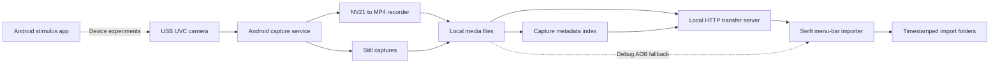

# Phonecapture

**Capture external-camera media on Android, then import it into a native macOS workflow.**

Built by **Jackie Oliver** at Haptica. I built the Android capture application, media metadata and transfer path, macOS importer, and device stimulus tooling.

**Java/Android · USB UVC · MediaCodec/MP4 · HTTP · Swift/AppKit · ADB**

## Architecture



## Read the implementation

| Component | Role |
| --- | --- |
| [UvcCaptureService](apps/kiosk-android/app/src/main/java/com/hapticasensorics/phonecapturekiosk/UvcCaptureService.java) | USB-camera lifecycle, capture state, and service coordination. |
| [Nv21Mp4Recorder](apps/kiosk-android/app/src/main/java/com/hapticasensorics/phonecapturekiosk/Nv21Mp4Recorder.java) | Frame-to-video encoding. |
| [CaptureMetadataStore](apps/kiosk-android/app/src/main/java/com/hapticasensorics/phonecapturekiosk/CaptureMetadataStore.java) | Capture index and metadata persistence. |
| [LocalTransferServer](apps/kiosk-android/app/src/main/java/com/hapticasensorics/phonecapturekiosk/LocalTransferServer.java) | Status/index/media endpoints, safe basename checks, and range handling. |
| [ImporterModel](apps/import-menubar/Sources/ImporterModel.swift) | Device discovery, HTTP/ADB transport, import tracking, and timestamp preservation. |
| [Native UI](apps/import-menubar/Sources/PhonecaptureImportBarApp.swift) | Menu-bar workflow and status. |
| [Stimulus app](apps/source-stimulus-android/app/src/main/java/com/hapticasensorics/phonecapturesourcestimulus) | Repeatable on-device visual stimulus experiments. |

## Engineering decisions

- **Capture locally, import later.** The device owns recording; desktop availability is not a prerequisite for capturing media.
- **Index the media.** Metadata gives the importer a capture inventory and timestamps without downloading every file first.
- **Keep transport choices behind one importer.** HTTP is the normal transfer path; debug builds can fall back to ADB.
- **Preserve capture time.** Imported files retain timing from the metadata index, with filename-based fallback. Import time and capture time are distinct.
- **Keep UI work off the transfer path.** The native model runs blocking import operations away from the main UI actor and reports progress/state back.

## Build

The Android apps include Gradle wrappers. With a compatible JDK and Android SDK configured:

```sh
cd apps/kiosk-android
./gradlew assembleDebug
cd ../source-stimulus-android
./gradlew assembleDebug
```

For macOS, open [PhonecaptureImportBar.xcodeproj](apps/import-menubar/PhonecaptureImportBar.xcodeproj) in Xcode. The project targets macOS 14+. Signing is your own configuration; no release signing identities or packaged applications are included.

The capture device serves media over unauthenticated local HTTP. Use a trusted isolated test network; this is not an internet-facing or authenticated media service. No capture service or importer was launched during publication.

## Verification and limits

The source and build definitions were reviewed on October 6, 2026. Native verification is **blocked on this host**: no Java runtime/Android SDK was available, and Swift type checking failed in the installed Apple toolchain with a duplicate `SwiftBridging` module before a reliable app result. Physical camera recording, transfer, frame timing, and device compatibility require hardware testing. No current end-to-end pass is claimed.

See [publication scope](PUBLICATION.md). All recordings, screenshots, device-specific settings, and packaged releases are excluded.
